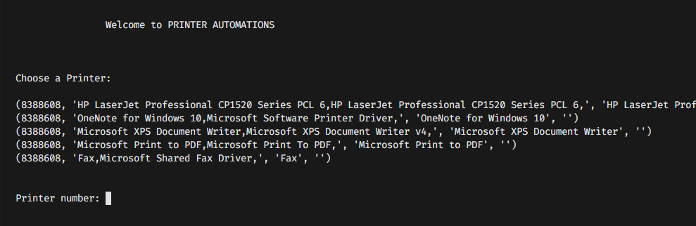
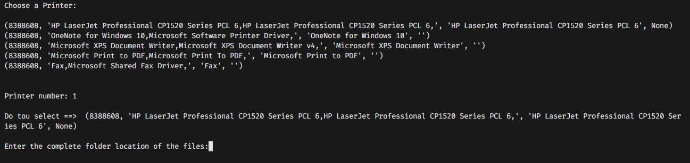

# Print Automation

## This is a simple print automation with python

#### You, like me, dont't like to do tedious jobs that can be automated ? 
This is a script for printing automation using Python, and it was made to get you out of tedious jobs! 

## How to use ?

The first thing do you need to use it, is install the dependency
> <b>python 3</b> and <b>pywin32</b>

To install the dependency is easy, you only need follow the steep on the <b>offical doc</b> basead at on your operational system link:

> [Python](https://www.python.org/downloads/)

## GETSTATED

- **Clone the repository**
    Open the prompt, terminal or PowerShell and copy/paste the next code/command   
> git clone https://github.com/Edgar3g/PrintingAutomation
- **install pywin32**  
    Open the corrent folder into prompt, Terminal or Powershell and execute 
> python -m pip install -r requiriment.txt

- **Run the code...**
> python main.py

When you run the code you will see the following

**It will show you a welcome screen, then will ask you to choose/select a printer**
*to select, just enter the number of printer position*   

the next is

When you select the printer, you just need to **paste/put**  the path to the folder that contains the files to be *printed*

example:  

> C:\Users\Dikenge\Desktop\docs

## well Done ✌😉🐱‍👤

#### Do you like it ? follow me :)

#### Do you want to contribute ?
Feel Free, fork the project and **go to the sky ;)**  